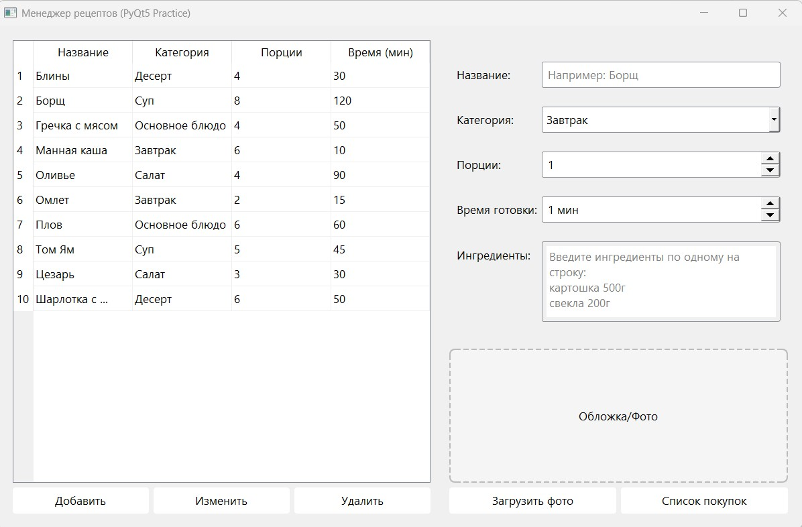
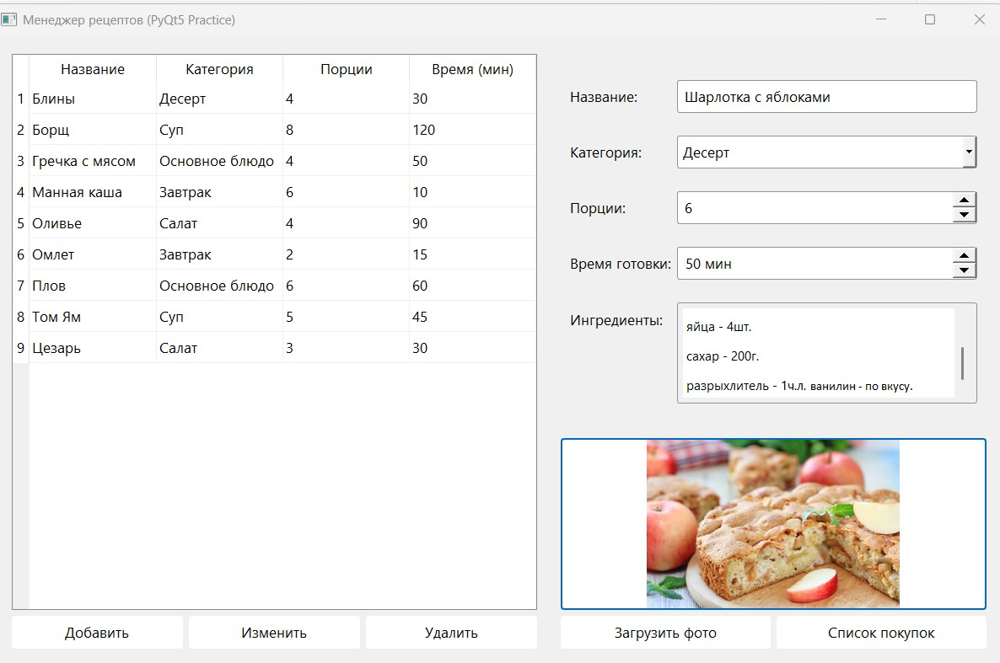
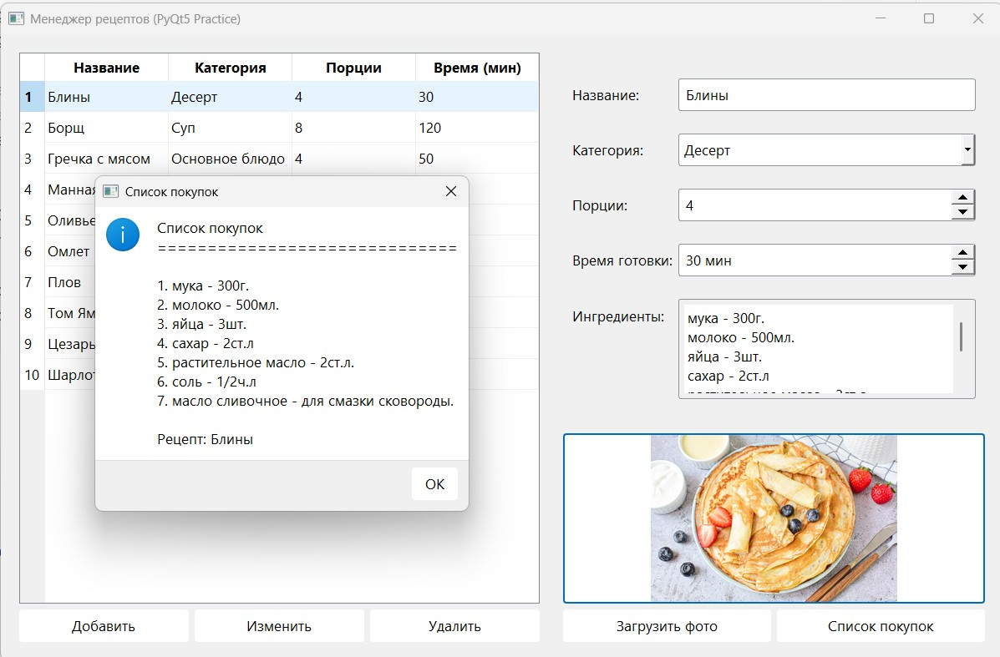
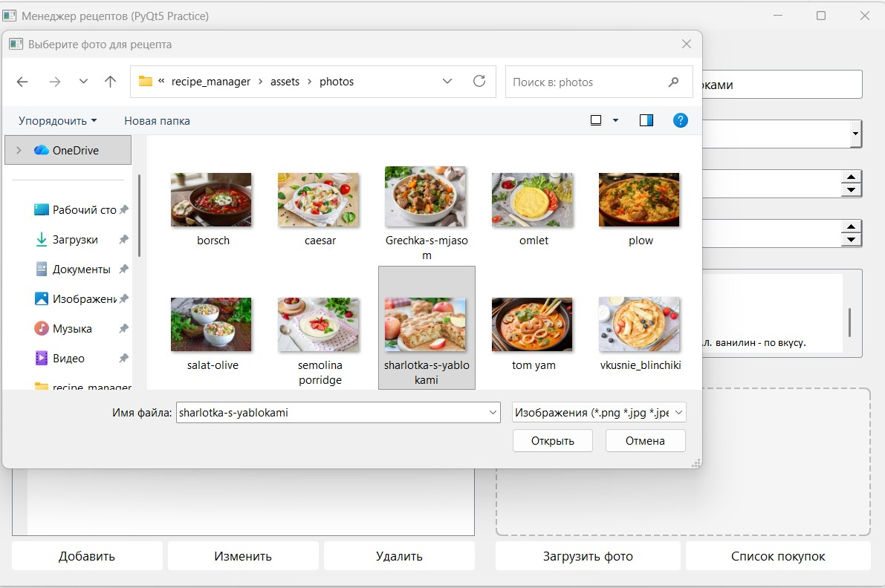
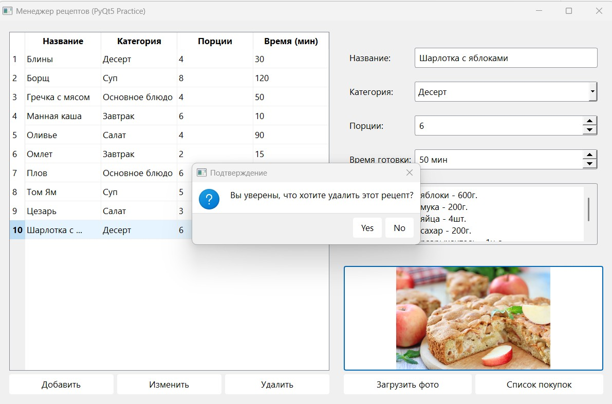
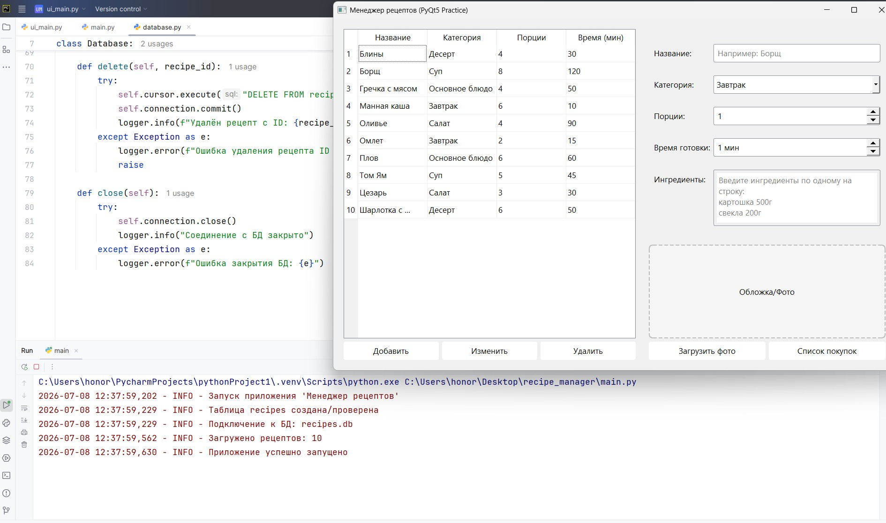

# PyQt5 Practice: Менеджер рецептов

Приложение для хранения и управления рецептами с возможностью добавления фотографий и генерации списка покупок.

## Запуск проекта
1. Создайте виртуальное окружение: `python -m venv venv`
2. Активируйте:
   - Windows: `venv\Scripts\activate`
   - macOS/Linux: `source venv/bin/activate`
3. Установите зависимости: `pip install -r requirements.txt`
4. Запустите: `python main.py`

## Структура проекта

```
recipe_manager/
├── main.py              # Точка входа в приложение
├── ui_main.py           # Главное окно (интерфейс + логика)
├── database.py          # Работа с базой данных SQLite
├── requirements.txt     # Список зависимостей
├── .gitignore           # Файлы, игнорируемые Git
├── README.md            # Инструкция по проекту
│
├── photos/              # Папка для изображений
│   └── (фото рецептов)
│
├── screenshots/         # Скриншоты для README
│   └── (фото скриншотов)
│
└── recipes.db           # База данных (создаётся автоматически)
```

## Скриншоты работы приложения

| **Главное окно** | **Добавление рецепта** |
|:---:|:---:|
|  |  |
| *Таблица с рецептами и форма ввода* | *Заполнение полей для нового рецепта* |

| **Список покупок** | **Загрузка фото** |
|:---:|:---:|
|  |  |
| *Генерация списка покупок из ингредиентов* | *Выбор изображения для рецепта* |

| **Подтверждение удаления** | **Логирование** |
|:---:|:---:|
|  |  |
| *Диалог подтверждения перед удалением* | *Логирование действий в консоли* |

## Горячие клавиши

| Комбинация | Действие |
|------------|----------|
| `Ctrl+N`   | Добавить новый рецепт |
| `Ctrl+E`   | Редактировать выбранный рецепт |
| `Del`      | Удалить выбранный рецепт |
| `Ctrl+L`   | Загрузить фото |
| `Ctrl+S`   | Сгенерировать список покупок |
